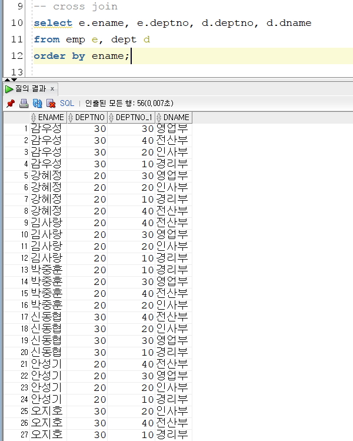
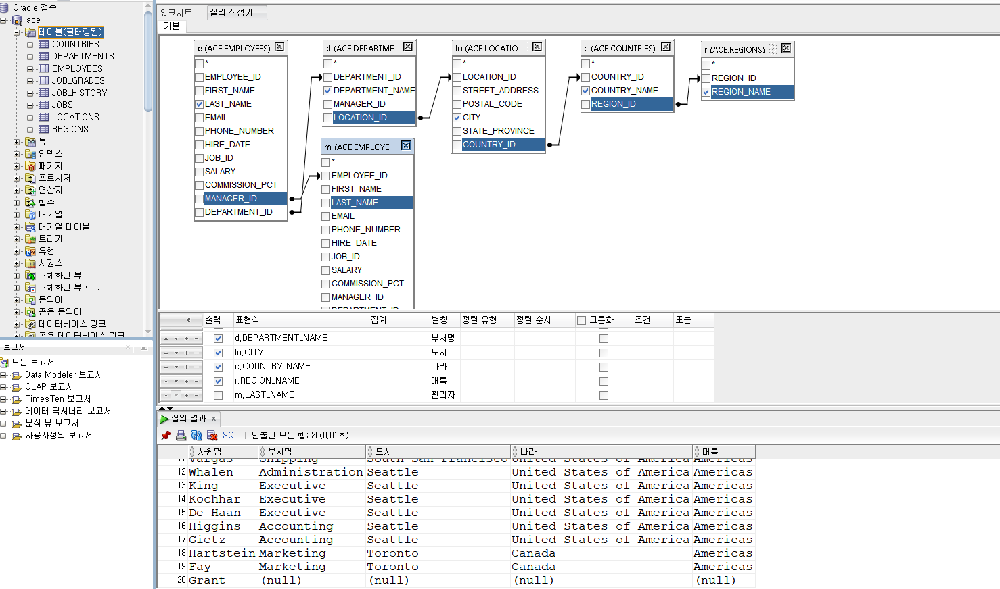

# 10장. 조인

- 조인 : 각 테이블에서 하나의 컬럼을 사용하여 두 개 이상의 테이블을 연결

| ORACLE JOIN | ANSI JOIN  |
| --- | --- |
| 1. CROSS JOIN (Cartesian JOIN) <br> 2. Natural join | 1. CROSS JOIN <br> 2. Natural join  ⇒ JOIN USING <br> -  Natural JOIN : 안 쓰는 것이 좋음 |
| 1. EQUI JOIN (동등 조인) <br> 2. NON EQUI JOIN <br> 3. OUTER JOIN <br> ◦ LEFT : 왼쪽 테이블 다 JOIN <br> ◦ RIGHT <br> ◦ FULL (X) <br> 4. SELF JOIN : 자기 자신과 조인하는 | 1. JOIN ON    |

## 1. 조인의 필요성

- 중복되어 저장된 데이터는 삽입, 수정, 삭제 시에 이상 현상을 발생할 수 있음
    - 중복 지양 위해 테이블을 2개 이상으로 분리함 ( ex. 사원/ 부서 —> 1개의 부서에 여러명의 사원 존재함 가능함)
        - 한 개 이상의 테이블에서 데이터를 조회하기 위해서 Join 사용
- 조인의 종류
    
    | 종류 | 설명 |
    | --- | --- |
    | Equi Join | 동일 컬럼을 기준으로 조인 |
    | Non-Equi Join | 동일 컬럼이 없이 다른 조건을 사용하여 조인 |
    | Outer Join | 조인 조건을 만족하지 않은 행도 나타냄 |
    | Self Join | 자기 자신 테이블과 조인  |
    
## 2. Cross Join

- Join 조건을 주지 않아서 테이블들을 모두 매칭 한 결과
- 내부 데이터를 뻥튀기 할 때 사용



## 3. Equi Join

### 3-1. EQUI JOIN (동등 조인)

- join에 = 가 들어간

```sql
select e.ename, e.deptno, d.dname
from emp e, dept d
where e.deptno = d.deptno
order by ename;
```

### 3-2. NON EQUI JOIN

- equi 이외의 조건이 들어간

```sql
select e.ename  as 사원명
      ,e.sal   as 급여
      ,s.grade as 등급
from emp e, salgrade s
where s.losal <= e.sal and e.sal <= s.hisal; 
-- where e.sal between s.losal and s.hisal;
```

## 4. Outer Join

- 주로 LEFT 사용, 반대쪽에 (+) 추가
- outer join은 full outer join 지원하지 않음

### 4-1. Left Outer Join

```sql
select e.last_name ,d.department_id ,d.department_name
from employees e, departments d
where e.department_id = d.department_id(+);
```

### 4-2. Right Outer Join

```sql
select e.last_name, d.department_name
from employees e ,departments d
where e.employee_id(+) = d.manager_id;
```

## 5. Self Join

- 자기 자신과 조인을 맺는

```sql
-- 사원의 멘토 알아내기 
-- 사원명     | 멘토명 
-- last_name  | last_name

select e.ename as 사원
      ,m.ename as 멘토
from emp e, emp m
where e.mgr = m.empno;

-- mgr가 null인 '사장 안성기'도 출력하고 싶을 때  
-- Left Outer Self Join
-- where e.mgr = m.empno(+);
```

## 6. ANSI Join (표준 조인)

- Oracle Join
    - 유지 보수를 위해 사용
- ANSI Join
    - 다른 DBMS 와의 호환성이 더 좋음
    - from , → from Join
    - where → On

### 6-1. ANSI Cross Join

- Oracle Join 보다 명시적으로 표기하기 때문에 더 좋음

```sql
select e.ename, e.deptno, d.deptno, d.dname
from emp e cross join dept d;
```

- Natural Join
    - 프로그램을 공부할 때 예제를 빠르게 쓸 때 사용
    - 안쓰는 것이 제일 좋음
    - Join 조건을 안쓰기 때문에 자동 조인
        - 오류 발생할 수 있음
            - using 사용해 조인 조건 명시
                
                ```sql
                -- 값이 이상하게 나옴 
                select e.last_name ,d.department_id ,d.department_name
                from employees e join departments d
                on e.department_id = d.department_id;
                
                -- 변경 
                select last_name, department_name
                from employees join departments
                using(department_id); -- 조인 조건 명시
                ```
                

### 6-2. ANSI Inner Join (Equl join)

```sql
select e.ename, e.deptno, d.dname
from emp e inner join dept d
on e.deptno = d.deptno;
```

```sql
select e.ename  as 사원명
      ,e.sal   as 급여
      ,s.grade as 등급
from emp e inner join salgrade s
on e.sal between s.losal and s.hisal;
```

### 6-3. ANSI Outer Join

- + 를 빼고 left, right 표기
- Left Outer Join
    
    ```sql
    select e.ename, e.deptno, d.dname
    from emp e left join dept d
    on e.deptno = d.deptno;  -- FROM 나열하는 순서와 맞춰주는 것이 좋음
    ```
    
- Right Outer Join
    
    ```sql
    select e.ename, e.deptno, d.dname
    from emp e right join dept d
    on e.deptno = d.deptno;
    ```
    
- full outer Join
    
    ```sql
    select e.ename, e.deptno, d.dname
    from emp e full outer join dept d
    on e.deptno = d.deptno;
    ```
    

## 7. Threeways Join

- 무조건 테이블 2개씩 조인한 다음 결과 집합을 다시 조인
    - 반드시 결과 집합을 확인하며 조인
- oracle
    - 주로 한번에 조인 → 매우 좋지 않음
- ANSI join
    - Table 2개씩 조인하기
        - 먼저 2개 table 을 조인한 다음 결과 테이블을 가지고 다시 조인
    
    ```sql
    
    -- 사원명 | 부서명 | 등급 
    
    ------------
    -- Oracle --
    ------------
    select e.ename as 사원명
          ,nvl(d.dname, '대기발령') as 부서명
          ,s.grade as 등급
    from emp e, dept d, salgrade s
    where e.deptno = d.deptno(+)
    and   e.sal between s.losal and s.hisal;
    
    ---------------
    -- ANSI Join --
    ---------------
    select e.ename as 사원명
          ,d.dname as 부서명
          ,s.grade as 등급
    from emp e 
    left join dept d 
    on e.deptno = d.deptno
    inner join salgrade s
    on e.sal between s.losal and s.hisal;
    ```
    
    ```sql
    ------------
    -- Oracle --
    ------------
    select e.ename as 사원명
          ,d.dname as 부서명
          ,s.grade as 등급
    from emp e 
    left join dept d 
    on e.deptno = d.deptno
    inner join salgrade s
    on e.sal between s.losal and s.hisal;
    
    ---------------
    -- ANSI Join --
    ---------------
    select e.last_name       as 사원명
          ,d.department_name as 부서명
          ,e.salary          as 급여
          ,j.grade_level     as 등급
    from employees e 
    left join departments d 
    on e.department_id = d.department_id
    inner join job_grades j
    on e.salary between j.lowest_sal and j.highest_sal;
    ```
    
    ```sql
    ------------
    -- Oracle --
    ------------
    select e.last_name       as 사원명
          ,d.department_name as 부서명
          ,m.last_name       as 사수명
          ,lo.city           as 도시명
          ,j.job_title       as 업무
    from employees e ,departments d ,employees m ,locations lo 
        ,jobs j 
    where e.department_id = d.department_id(+)
    and   e.manager_id = m.employee_id(+)
    and   d.location_id = lo.location_id(+)
    and   e.job_id = j.job_id;
    
    ---------------
    -- ANSI Join --
    ---------------
    select e.LAST_NAME       as 사원명
          ,e.SALARY          as 급여
          ,j.GRADE_LEVEL     as 등급
          ,d.DEPARTMENT_NAME as 부서명 
          ,lo.city           as 도시명
          ,c.country_name    as 나라명
    from EMPLOYEES e 
    inner join JOB_GRADES j
    on e.SALARY between j.LOWEST_SAL and j.HIGHEST_SAL
    left join DEPARTMENTS d
    on e.DEPARTMENT_ID = d.DEPARTMENT_ID
    left join locations lo
    on d.location_id = lo.location_id
    left join countries c
    on lo.country_id = c.country_id;
    
    ```
    

 

---

### SQL Developer ‘질의 작성기’

1. table 더블 클릭 → 별칭 붙이기 
2. join 하기 
3. outer join (선 더블클릭)




```sql
SELECT
    e.last_name       AS 사원명,
    d.department_name AS 부서명,
    lo.city           AS 도시,
    c.country_name    AS 나라,
    r.region_name     AS 대륙,
    m.last_name       AS 사수명
FROM
    ace.employees   e
    LEFT JOIN ace.departments d ON e.department_id = d.department_id
    LEFT JOIN ace.locations   lo ON d.location_id = lo.location_id
    LEFT JOIN ace.countries   c ON lo.country_id = c.country_id
    LEFT JOIN ace.regions     r ON c.region_id = r.region_id
    LEFT JOIN ace.employees   m ON e.manager_id = m.employee_id
```