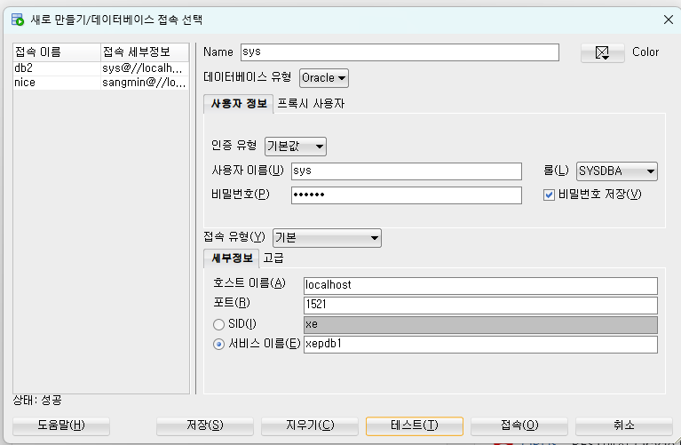
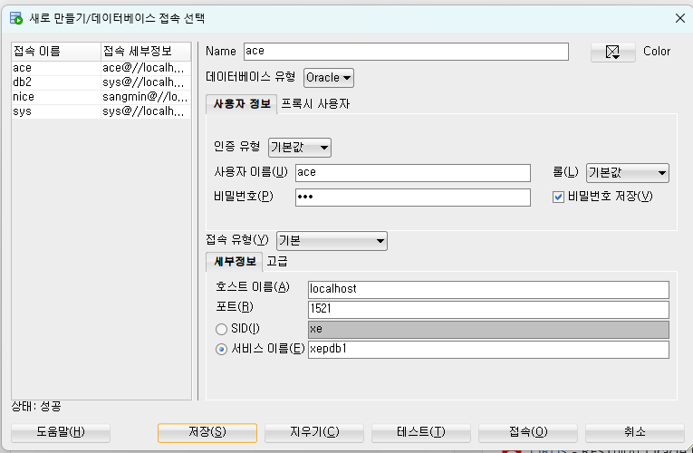

# 1장. 데이터베이스 개념과 오라클 설치


## 5. 오라클을 다운받아 설치하기

### 5-1. 다운 받아서 zip 압축 해제

### 5-2. Connecting to a Pluggable Database (PDB)

- 용량 부족할 시
    
    ```bash
    =============================
     Oracle 21c XE 설치 후
    =============================
    
      C:\Users\COM> notepad xe_start.bat
    
        net start OracleOraDB21Home1TNSListener
        net start OracleServiceXE
    
      C:\Users\COM> notepad xe_stop.bat
    
        net stop OracleServiceXE
        net stop OracleOraDB21Home1TNSListener
    
      C:\Users\COM> xe_stop
      C:\Users\COM> xe_start
    ```
    
- 참고
    - https://oracle-base.com/articles/12c/multitenant-connecting-to-cdb-and-pdb-12cr1#pdb
    
    ```bash
      [1] 설치 뒤 SQL*Plus로 접속
    
      C:\Users\COM> sqlplus / as sysdba         <- CDB에 접속하는 것임
    
      SQL> col name format a30
      SQL> col pdb  format a30
    
      SQL> select name, pdb
           from   v$services
           order  by name;
    
      NAME                           PDB
      ------------------------------ ------------------------------
      SYS$BACKGROUND                 CDB$ROOT
      SYS$USERS                      CDB$ROOT
      xe                             CDB$ROOT   <- CDB(Container Database)
      xeXDB                          CDB$ROOT
      xepdb1                         XEPDB1     <- PDB(Pluggable Database), 우리가 사용할 DB
    
      SQL> show con_name
    
      CON_NAME
      ------------------------------
      CDB$ROOT
    
      SQL> alter session set container = xepdb1;
    
      SQL> show con_name
    
      SQL> exit
    ```
    

### 5-3. user 생성 후 권한 부여

- user : 우리가 사용할 서비스 관리자
    
    ```sql
      C:\Users\COM> sqlplus system/oracle@localhost:1521/xepdb1     <- PDB에 관리자로 접속
    
      SQL> show con_name
    
      CON_NAME
      ------------------------------
      XEPDB1
    
      SQL> create user ace
           identified by ace
           default tablespace users
           temporary tablespace temp;
    
      SQL> alter user ace
           quota unlimited on users;
    
      SQL> grant connect, 
                 resource,
                 create session, 
                 create table,
                 create procedure,
                 create trigger,
                 create view,
                 create sequence
           to ace;
          
      SQL> exit
    
      C:\Users\COM> sqlplus ace/ace@localhost:1521/xepdb1
    
      SQL> show con_name
    
      CON_NAME
      ------------------------------
      XEPDB1
    
      SQL> show user
      USER은 "ACE"입니다
    ```
    

### 5-5. user 접속 후 , table 생성

```sql
> sqlplus /nolog
> conn ace/ace@localhost:1521/xepdb1
> @:\dv\creobjects.sql  // 드래그인 드래그 
```

<table>
  <tr>
    <td></td>
    <td></td>
  </tr>
</table>

사용자 이름 : system 

비밀번호 : oracle 

- 우리가 사용할 서비스만의 관리자

워크 스페이스 > 쿼리 실행

```sql
# 대소문자 맞추기 

select last_name, salary 
from employees;

SELECT last_name, salary 
FROM employees;
```

- select
    - 검색/조회 쿼리
    - 우리가 원하는 데이터 집합을 Oracle에게 요청하고 묘사하는 언어
- Oracle
    - RDBMS (관계형 데이터베이스 관리 시스템)
    - 21c (c : cloud & Consolidation) 버전까지 등장
    - 특징
        - 클라우드 용으로 설계
        - 다수의 데이터베이스를 하나로 관리
            - 컨테이너로 관리 → 멀티 테넌트 컨테이너 데이터베이스
            - DB는 플러거블DB (PDB) 로 불림
- RDBMS
    - 테이블을 이용함
        - 행과 열로 구성된
        

## 6. SQL에 접속하여 사용자 계정 만들기

- SQL 명령어의 유형
    
    
    | 유형 | 명령문 |  |
    | --- | --- | --- |
    | DQL | SELECT  | 데이터 검색  |
    | DML | INSERT | 데이터 입력 |
    |  | UPDATE | 데이터 수정 |
    |  | DELETE | 데이터 삭제 |
    | DDL | CREATE | DB 생성 |
    |  | ALTER | DB 변경 |
    |  | DROP | DB 삭제 |
    |  | RENAME | DB 객체 이름 변경 |
    |  | TRUNCATE | DB 저장 공간 삭제 |
    | TCL | COMMIT | 트랜잭션의 정상적인 종료 처리 |
    |  | ROLLBACK | 트랜잭션 취소 |
    |  | SAVEPOINT | 트랜잭션 내에 임시 저장점 설정 |
    | DCL | GRANT | DB에 권한 부여 |
    |  | REVOKE | DB에 권한 취소  |

<aside>
💡 SQL Language Reference 많이 참조하자

- https://docs.oracle.com/en/database/oracle/oracle-database/21/sqlrf/AVG.html#GUID-B64BCBF1-DAA0-4D88-9821-2C4D3FDE5E4A
</aside>

## 7. Oracle SQL Developer를 설치하고 실습을 위한 예제 테이블 생성하기

### 7-1. 예제 테이블 살피기

employee 직원 

manager  상사 

commission 

Jobs : Jobs_History = 1 : n  

### 7-3. 데이터 타입

- 오라클에서 지원하는 데이터 타입의 종류

| 데이터 타입 | 의미 |
| --- | --- |
| CHAR(size) | size 크기의 고정 길이 문자 데이터 타입 <br> 최대 : 2000 바이트 <br>최소 : 1바이트 |
| VARCHAR2(size) | size 크기의 가변 길이 문자 데이터 타입 <br> 최대 : 4000 바이트 <br> 최소 : 1바이트 |
| NVARCHER2(size) | 국가별 문자 집합에 따른 size 크기의 가변 길이 문자 데이터 타입 <br> 최대 : 4000 바이트 <br> 최소 : 1바이트 |
| NUMBER( p, s) | 정밀도(p)와 스케일(s)로 표현되는 숫자 데이터 타입 <br> p : 1 ~ 38 <br> s : -84 ~ 127 |
| DATE | 날짜 형식을 저장하기 위한 데이터 타입 |
| ROWID | 테이블 내 행의 고유 주소를 가지는 64진수 문자 타입 <br> 해당 6바이트(제한된 ROWID)  |
| BLOB | 대용량의 바이너리 데이터를 저장 <br> 최대 크기 : 4 GB |
| CLOB | 대용량의 텍스트 데이터를 저장 <br> 최대 크기 : 4 GB |
| BFILE | 대용량의 바이너리 데이터를 파일 형태로 저장 <br> 최대 크기 : 4 GB |
| TIMESTAMP(n) | DATE 데이터 타입의 확장된 형태 <br> n은 milli second 자릿수로 최대 9자리까지 표현 가능 |
| INTERVAL YEAR TO MONTH | 년과 월을 이용하여 기간을 저장 |
| INTERVAL DAY TO SECOND | 일, 시, 분, 초를 이용하여 기간을 저장 <br> 두 날짜 값의 정확한 차이를 표현하는 데 유용  |

<aside>
💡 년도는 yyyy로 작성하기 (구분하기 싶지 않음)

</aside>


### 7-4. 데이터 무결성과 제약 조건

1. NOT NULL 제약 조건
    - 프로그래밍에서 NULL : 참조 값이 필요한데 참조하지 않은 것
    - DB에서 NULL : 알 수 없음, 아직 무엇인지 모르는 값
        - NIULL은 나타나면 안됨
2. 기본 키 제약 조건
3. 외래 키 제약 조건 

<aside>
💡 * 은 프로그램 내에서 작성하지 않고, 정확하게 필요한 칼럼만 가져오기!

</aside>

- TRUE OR anything : 항상 TRUE
- FALSE OR anything : 항상 anything
- TRUE OR anything : 항상 TRUE
- NULL OR anything : 항상 anything

| OR | TRUE | FALSE | NULL |
| --- | --- | --- | --- |
| TRUE | TRUE | TURE | TRUE |
| FALSE | TRUE | FALSE | NULL |
| NULL | TRUE | NULL | NULL |

| AND | TRUE | FALSE | NULL |
| --- | --- | --- | --- |
| TRUE | TRUE | FALSE | TRUE |
| FALSE | FALSE | FALSE | FALSE |
| NULL | NULL | FASLE | NULL |