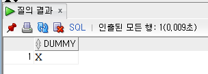
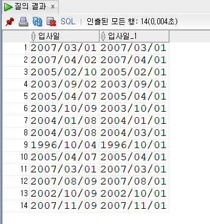

# 3장. 오라클 주요 함수 

- 단일행 함수
- 복수행 함수 (집계)

## 1. DUAL 테이블

- Dummy한 테이블임
    - DUMMY 라는 단 하나의 컬럼으로 구성되어 있음
    
    
    

## 2. 숫자 함수

### 2-1. ABS() : 절댓값 구하는

```sql
select -10, abs(-10) from dual; -- -10, 10
```

### 2-2. FLOOR() : 소수점 아래 버리는

```sql
select 34.5678, floor(34.5678) from dual; -- 34.5678, 34
```

### 2-3. ROUND() : 특정 자릿수에서 반올림

```sql
select 34.5678, round(34.5678) from dual; -- 34.5678, 35
select 34.5678, round(34.5678, 2) from dual; -- 34.5678, 34.57
```

### 2-4. TRUNC() : 특정 자릿수에서 잘라내는

- 2 : 소수점 3번째 자리에서 버림 연산 수행하여, 소수점 이하 2번째 자리까지 표시
- 0 : 소수점 자리에서 버림 연산 수행
    - 인자 x : 0으로 간주
- -1 : 일의 자리에서 버림 연산 수행

```sql
select trunc(34.5678, 2)
        ,trunc(34.5678, -1)
        ,trunc(34.5678)
from dual; -- 34.56, 30, 34 
```

### 2-5. MOD() : 나머지 구하는

```sql
select mod(27,2), mod(27,5), mod(27,7)
from dual; -- 1, 2, 6 
```

## 3. 문자 처리 함수

### 3-1. 대소문자 변환 함수

| 구분 | 설명 |
| --- | --- |
| UPPER | 대문자로 변환 |
| LOWER | 소문자로 변환 |
| INITCAP | 첫 글자만 대문자로, 나머지 글자는 소문자로 변환 |

```sql
select 'welcome to Oracle'
    , upper('welcome to Oracle')
    , lower('welcome to Oracle')
    , initcap('welcome to Oracle')
from dual;
```

### 3-2. 문자 길이 구하는 함수

| 구분 | 설명 |
| --- | --- |
| LENGTH | 문자의 길이를 반환 (한글 1Byte) |
| LENGTHB | 문자의 길이를 반환 (영어 : 1byte, 한글 1자 : 3byte)  |

```sql
SELECT LENGTH('Oracle'), LENGTH('오라클')
FROM DUAL; -- 6, 3

SELECT LENGTHB('Oracle'), LENGTHB('오라클')
FROM DUAL; -- 6, 9 
```

### 3-3. 문자 조작 함수

- DB index 는 1부터 시작

| 구분 | 설명 |
| --- | --- |
| CONCAT | 문자의 값을 연결 |
| SUBSTR | 문자 일부 추출  (한글 1Byte) <br> 형식 : substr (대상, 시작위치, 추출할 개수) |
| SUBSTRB | 문자 일부 추출 (영어 : 1byte, 한글 :  3byte)<br> 문자 개수가 아닌 메모리에 저장된 바이트 반환  |
| INSTR | 특정 문자의 위치 값을 반환 (한글 1Byte) <br> 대상 : instr(대상, 찾을 글자, 시작위치, 몇_번째_발견)  |
| INSTRB | 특정 문자의 위치 값을 반환 (한글 2Byte) |
| LPAD, RPAD | 특정 기호로 채움 <br> LPAD (Left padding) <br> RPAD (Right paddig) |

```sql
select SUBSTR('welcome to Oracle', 4, 3) from DUAL; -- 4번째 글자부터 3글자 추출 
select SUBSTR('welcome to Oracle', -4, 3) from DUAL; -- 뒤쪽 4번째 글자부터 3글자 추출 
select SUBSTRB('웰컴투오라클', 4, 3) from DUAL; -- 결과 : 컴

select INSTR('WELCOME TO ORACLE', 'O') from DUAL; -- 5
select INSTR('WELCOME TO ORACLE', 'O', 6, 2) from DUAL;  -- 12
select INSTR('데이터베이스', '이', 4, 1) from DUAL; -- 5
select INSTRB('데이터베이스', '이', 4, 1) from DUAL; -- 4

select LPAD ('Oracle', 20, '#') from DUAL; -- ##############Oracle
select RPAD ('Oracle', 20, '#') from DUAL; -- Oracle##############
```

## 4. 형 변환 함수

### 4-1. to_char() : 날짜 형 또는 숫자형을 문자형으로 변환

- to_char (날짜 데이터, ‘출력 형식’)
    
    
    - 형 변환 함수의 날짜 출력 형식
    
    | 종류 | 의미 |
    | --- | --- |
    | YYYY | 년 (4자리) |
    | YY | 년 |
    | MM | 월을 숫자로 |
    | MON | 월을 알파벳으로 |
    | DAY | 요일 |
    | DY | 요일 약어로 |
    
    
    - 형 변환 함수의 시간 출력 형식
    
    | 종류 | 의미 |
    | --- | --- |
    | AM 또는 PM | 오전, 오후 시각 |
    | HH  또는 HH12 | 시간 (1~12) |
    | HH24 | 시간 (0~23) |
    | MI | 분 |
    | SS | 초 |
    - 날짜형을 문자형으로 변환
        
        ```sql
        SELECT sysdate, to_char(sysdate, 'YYYY-MM-DD') 
        FROM dual;
        SELECT hiredate, to_char(hiredate, 'YYYY/MM/DD DAY') 
        FROM emp;
        SELECT to_char(sysdate, 'YYYY/MM/DD, AM HH:MI:SS') 
        FROM dual; -- 현재 날짜와 시간을 출력하기
        ```
        
    - 숫자형을 문자형을 변환
        - 형 변환 함수의 숫자 출력 형식
        
        | 구분 | 설명 |
        | --- | --- |
        | 0 | 자릿수를 나타내며 자릿수가 맞지 않을 경우 0으로 채움 |
        | 9 | 자릿수를 나타내며 자릿수가 맞지 않아도 채우지 않음 |
        | L | 각 지역 별 통화 기호를 앞에 표시 |
        | . | 소수점 |
        | , | 천 단위 자리 구분 |
        
        ```sql
        select to_char(1230000), to_char(1230000, 'L999,999,999') 
        from dual; -- 123000, ￦1,230,000
        
        select to_char(123456, '000000000')
               ,to_char(123456, '999,999,999')
        from dual; -- 000123456,  123,456
        ```
        

### 4-2. to_date() : 문자형을 날짜형을 변환

- to_date(’문자’, ‘format’)
    
    ```sql
    -- 2007년 4월 2일에 입사한 사원 검색 
    -- 오류 이유 : 데이터 형이 일치하지 않기 때문 
    select ename, hiredate
    from emp
    where hiredate=20070402;
    
    -- 변경 코드
    select ename, hiredate
    from emp
    where hiredate= to_date(20070402, 'YYYYMMDD');
    
    --------------------------------------------------------
    -- 올해 며칠이 지났는지 알아보기 
    -- 오류 이유 : 데이터 형이 일치 X  
    select sysdate-'2013/01/01'
    from dual;
    
    -- 변경 코드
    select trunc(sysdate-to_date('2013/01/01', 'YYYY/MM/DD'))
    from dual;
    ```
    

### 4-3. to_number : 문자형을 숫자형으로 변환

```sql
-- 오류 이유 : '20,000' 과 '10,000' 은 문자형이기 때문
select '20,000' - '10,000'
from dual;

-- 변경 코드
select to_number('20,000','99,999') - to_number('10,000','99,999')
from dual;
```

## 5. 날짜 함수

| 구분 | 설명 |
| --- | --- |
| SYSDATE | 시스템에 저장된 현재 날짜를 반환 |
| MONTHS_BETWEEN | 두 날짜 사이가 몇개월인지를 반환 |
| ADD_MONTHS | 특정 날짜에 개월 수를 더함 |
| NEXT_DAY | 특정 날짜에서 최소로 도래하는 인자로 받는 요일의 날짜를 반환함 |
| LAST_DAY | 해당 달의 마지막 날짜를 반환 |
| ROUND | 인자로 받는 날짜를 특정 기준으로 반올림함 |
| TRUNCE | 인자로 받은 날짜를 특정 기준으로 버림  |

### 5-1. SYSDATE () : 현재 날짜를 반환

```sql
SELECT to_char(SYSDATE, 'YYYY/MM/DD') 
FROM DUAL;

select to_char(SYSDATE-1, 'YYYY/MM/DD') 어제
       ,to_char(SYSDATE, 'YYYY/MM/DD') 오늘
       ,to_char(SYSDATE+1, 'YYYY/MM/DD') 내일
from dual;
```

### 5-2. ROUND () : 특정 조건을 기준으로 반올림하는

- 형식 : ROUND(date, format)

### 5-3. TURNC () : 특정 기준으로 버리는



```sql
select to_char(hiredate, 'YYYY/MM/DD') 입사일
      ,to_char(trunc(hiredate, 'MONTH'), 'YYYY/MM/DD') 입사일
from emp;
```

### 5-4. MONTHS_BETWEEN () : 두 날짜 사이의 간격을 구하는

```sql
-- 날짜 사이의 개월 수 구하기 
select ename, SYSDATE 오늘, to_char(hiredate, 'YYYY/MM/DD') 입사일, 
        TRUNC(MONTHS_BETWEEN(SYSDATE, hiredate)) 근무달수
from emp;
```

### 5-5. ADD_MONTHS () : 개월 수를 더하는

```sql
-- 입사 날짜에 6개월 추가하기 
SELECT ename, to_char(hiredate, 'YYYY/MM/DD') 입사일, 
            to_char(ADD_MONTHS(hiredate,6), 'YYYY/MM/DD') "입사 6개월 후"
FROM emp;
```

### 5-6. NEXT_DAY () : 해당 요일의 가장 가까운 날짜를 반환하는

```sql
SELECT to_char(SYSDATE, 'YYYY/MM/DD') 오늘, 
       to_char(NEXT_DAY(SYSDATE, '금요일'),'YYYY/MM/DD') 금요일 
FROM DUAL;
```

### 5-7. LAST_DAY () : 해당 달의 마지막 날짜를 반환하는

```sql
SELECT ename, to_char(hiredate, 'YYYY/MM/DD') 입사일, 
        to_char(LAST_DAY(hiredate),'YYYY/MM/DD') "마지막 날짜" 
FROM emp;
```

## 6. NULL을 다른 값으로 변환하는 NVL 함수

- NVL (expr1, expr2)   : NULL을 0 또는 다른 값으로 변환하기 위해 사용하는 함수
    - expr1 컬럼에 NULL이 저장되어 있으면, 이 컬럼 값을 exp2로 변경
- NULLIF(expr1, expr2)
    - expr1과 expr2의 표현값이 동일하면 NULL 반환, 같지 않으면 expr1 반환
- COALESCE (expr1, expr2, …, exprN)
    - 인수 중에서 NULL이 아닌 첫 번째 인수를 반환하는 함수

## 7. 선택을 위한 DECODE 함수

- switch case 문과 같은 기능
    - 여러가지 경우에 대해서 선택할 수 있도록 함
    
    ```sql
    SELECT ename, deptno, decode(deptno, 10, '경리부',
                                       20, '인사과',
                                       30, '영업부',
                                       40, '전산부') AS DNAME
    FROM emp;
    
    -- 체육대회를 합니다. 사번으로 홀수는 '청군', 짝수는 '백군'으로 출력
    -- 사원명 | 팀
    -- 이병헌 | 팀
    select ename, decode(mod(empno,2),0, '백군'
                                     ,1, '청군') as "팀"
    from emp;
    
    -- 부서에 따른 연봉의 차등 인상 
    -- 10부서 : 20퍼센트 인상
    -- 20    : 10퍼센트 인상
    -- 그외   : 동결
    select ename, sal as "올해 연봉", decode(deptno ,10 ,sal*1.2
                                                   ,20 ,sal*1.1
                                                       ,sal) as "내년 연봉"
    from emp;
    
    -- 연봉 등급 구분 
    select ename, sal , decode(ceil(sal/300)-1 ,0, 'LOW'
                                               ,1, 'MID'
                                               ,2, 'HIGH'
                                                 , 'TOP') as grade
    from emp;
    ```
    

## 8. 조건에 따라 서로 다른 처리가 가능한 CASE 함수

```sql
-- searched case 
select ename, deptno, sal as "올해 연봉", 
        case deptno when 10 then sal*1.2
                    when 20 then sal*1.1
                            else sal
        end as "내년 연봉"
from emp;

-- simpled case 
select ename, deptno, sal as "올해 연봉", 
        case when deptno=10 then sal*1.2
             when deptno=20 then sal*1.1
                            else sal
        end as "내년 연봉"
from emp;
```

```sql
-- searched case 
select ename, sal , 
        case ceil(sal/300)-1 when 0 then 'LOW'
                             when 1 then 'MID'
                             when 2 then 'HIGH'
                             else 'TOP'
         end as grade
from emp;

-- simpled case 
select ename, sal , 
        case when sal<=300 then 'LOW'
             when sal<=600 then 'MID'
             when sal<=900 then 'HIGH'
                           else 'TOP'
         end as grade
from emp;
```