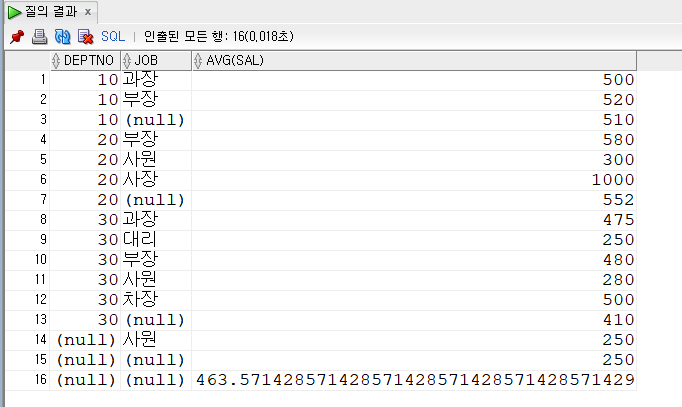
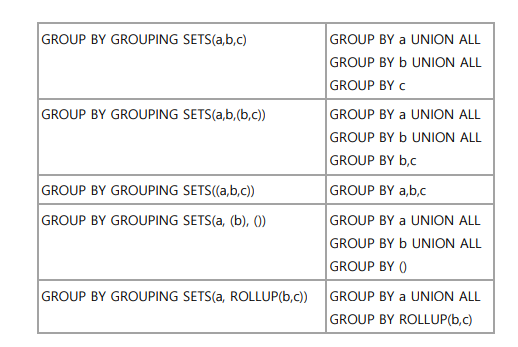

# Rollup & Cude | 계층형 쿼리 (Hierachical Query) | GROUPING SETS | with 절 

## 1. ROLLUP

- grouping 함수
    - 소계와 합계로 잡계되어 출력된 행을 구분할 때 사용함

```sql
select deptno,job, avg(sal)
from emp
group by deptno, job;

select deptno,job, avg(sal)
from emp
group by rollup(deptno, job)
order by deptno, job; -- 마지막은 전체 집계
```



## 2. 계층형 쿼리 (Hierachical Query)

- 내부에서 트리 구조로 이어나가서 보여줌
    - `connect by` : 시작점을 잡아주는 것이 중요함
    
    ```sql
    -- 부서 조직도를 다루는 계층형 쿼리
    select last_name, level from employees
    start with manager_id is null             -- start with : 시작 행 지정
    **connect by** manager_id = **prior** employee_id;
    ```
    
    - CONNECT_BY_ISLEAF : 더 이상 LEAF 데이터가 없으면 1, 있으면 0을 출력
    - CONNECT_BY_ROOT : ROOT 레벨을 찾음
    - SYS_CONNECT_BY_PATH : 각 데이터의 ROOT 값과 LEVEL 값을 출력
    - SIBLINGS BY : 같은 LEVEL 행들을 정렬
    
    ```sql
    select EMPLOYEE_ID,
           MANAGER_ID,
           level,
           connect_by_root LAST_NAME as 대표,  
           connect_by_isleaf as 막내,
           SYS_CONNECT_BY_PATH(LAST_NAME, '/') as path,
           LPAD(' ', (level - 1) * 3) || LAST_NAME as LAST_NAME,
           prior LAST_NAME
    from EMPLOYEES
    start with MANAGER_ID is null
    connect by MANAGER_ID = prior EMPLOYEE_ID
    order siblings by EMPLOYEE_ID asc;
    ```
    

## 3. GROUPING SETS

- group by 절 + union all



## 4. with 절

- 중복되는 쿼리를 block으로 만들어서 사용
    
    ```sql
    select 'sum', sum(sum_sal)
    from (select deptno , sum(sal) as sum_sal, count(*) as cnt
          from emp
          group by deptno)
    union all
    select 'avg', sum_sal/cnt
    from (select deptno , sum(sal) as sum_sal, count(*) as cnt
          from emp
          group by deptno);
    ----------------------------------------------------------------------------
    with a as (select deptno , sum(sal) as sum_sal, count(*) as cnt
               from emp
               group by deptno)
    select 'sum', sum(sum_sal)
    from a
    union all 
    select 'avg', sum_sal/cnt
    from a;
    ```
    

## 5. Multiple Column 서브쿼리

- 서브쿼리에서 구매된 적 있는 과일과 등급을 결과집합으로 얻고 그 결과집합을 메인쿼리의
WHERE 절에서 컬럼 대 컬럼으로 비교하여 해당 레코드를 최종결과집합으로 얻게 됨
    
    ```sql
    -- purchases 에서 구매하지 않은 과일들을 출력
    select * 
    from fruits
    where (name, grade) not in (select name, grade
                                from purchases);
    
    -- scott 계정의 dept 테이블과 emp 테이블을 이용하여 
    -- 각 부서별 최저 연봉을 받고 있는 
    -- 사원의 이름(ename), 부서번호(deptno), 급여(sal)를 출력
    
    select ename, deptno, sal
    from emp
    where (deptno, sal) in (select deptno, min(sal) 
                            from emp 
                            group by deptno);
    ```