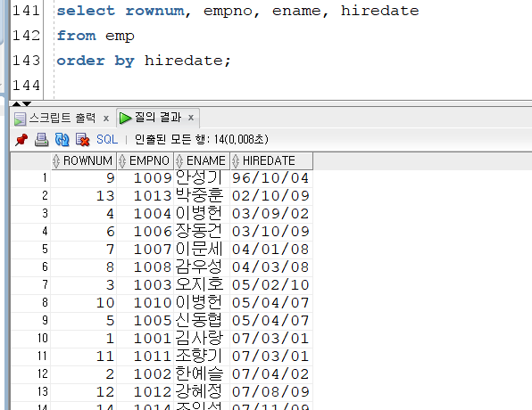

# 12장. 가상 테이블 뷰 

- 가상 테이블 - 좋은 말은 아닐 수도..?
- 뷰 (view)
    - **쿼리를 저장하고 있는 오브젝트**
    - 복잡한 쿼리, 자주 사용하는 쿼리를 빠르게 불러오고 싶을 때 사용
    - 필요한 컬럼만 select 한 것만 제공 (개인 정보와 같은 것을 주고 싶지 않을 때)
    - **오라클 객체라고 함**

## 1. 뷰의 개념과 뷰 생성하기

- 사용자에게
- 서브쿼리 → 일시적으로 뷰를 만든 다음에
- 인라인 뷰
    - 순간적으로 뷰 생성 후 사용하는

```sql
-- p. 436
-- 30번 부서에 소속된 사원 정보 출력하는 뷰 정의하기 
create view emp_view30
as 
select empno, ename, deptno
from emp_copy
where deptno = 30;

--30번 부서에 소속된 사원 정보를 출력하는 뷰 사용
select * from emp_view30;
```

## 2. 뷰의 내부 구조와 USER_VIEWS 데이터 딕셔너리

- 뷰에 데이터를 추가하면 기본 테이블 변경됨
    - 뷰는 쿼리문에 대한 이름일 뿐이기 때문
        
        ```sql
        insert into emp_view30
        values(1111, 'aaaa', 30);
        
        select * from emp_view30;
        select * from emp_copy;
        ```
        

### 2-1. 뷰를 사용하는 이유

- 복잡하고 긴 쿼리문을 뷰로 정의하면 접근을 단순화시킬 수 있음
- 보안에 유리함

- view
    - 일반 view : 논리적인 테이블
    - materialized view : 물리적으로 존재하는 테이블
        - 통계에 필요 → 수행 시간 절약 가능함

- complex view
    - 조인된 쿼리를 가지고 있는 view
    
    ```sql
    create view emp_view_dept
    as
    select e.empno, e.ename, e.sal, e.deptno, d.dname, d.loc
    from emp_copy e 
    join dept d
    on e.deptno = d.deptno;
    select * from emp_view_dept;
    ```
    

## 3. 뷰 제거하기

```sql
drop view emp_view_dept; -- 휴지통에 존재 x >> 쿼리문이기 때문에
```

## 4. 뷰의 다양한 옵션

### 4-1. 뷰 수정하기 위한 OR REPLACE 옵션

```sql
**create OR REPLACE** view emp_view30
as 
select empno, ename, deptno
from emp_copy
where deptno = 30;
```

### 4-2. 기존 테이블 없이 뷰를 생성하기 위한 FORCE 옵션

- FORCE
    - 기본 테이블이 존재하지 않은 경우에도 뷰를 생성해야 할 경우 사용
        
        ```sql
        create or replace FORCE view employees_view
        as 
        select empno, ename, deptno
        from employees
        where deptno = 30; -- 경고: 컴파일 오류와 함께 뷰가 생성되었습니다
        ```
        
- NOFORCE
    - 기본 테이블이 있는 경우에만 뷰가 생성되도록 하기
        
        ```sql
        create or replace NOFORCE view existtable_view
        as 
        select empno, ename, deptno
        from employees
        where deptno = 30; -- ORA-00942: 테이블 또는 뷰가 존재하지 않습니다
        ```
        

### 4-3. 조건 칼럼 값을 변경하지 못하게 하는 WITH CHECK OPTION

```sql
create or replace view view_chk30
as 
select empno, ename, sal, comm, deptno
from emp_copy
where deptno = 30 WITH CHECK OPTION;

select * from view_chk30;

-- 조건에 해당하는 부분 수정 불가능
-- ORA-01402: 뷰의 WITH CHECK OPTION의 조건에 위배 됩니다 
update view_chk30 
set deptno = 20
where sal >= 300;
```

### 4-4. 뷰를 통해 기본 테이블의 변경을 막는 WITH READ ONLY 옵션

```sql
create or replace view VIEW_READ30
as 
select empno, ename, sal, comm, deptno
from emp_copy2
where deptno = 30 **WITH READ ONLY**;

-- ORA-42399: 읽기 전용 뷰에서는 DML 작업을 수행할 수 없습니다
update VIEW_READ30 set comm=2000;
```

## 5. 인라인 뷰로 TOP-N

- **TOP-N 을 구하기 위해서 ROWNUM과 인라인 뷰 사용**됨
    - rownum
        
        ```sql
        select rownum, empno, ename, hiredate
        from emp; 
        ```
        
- select 전에 from이 먼저 수행됨
- from > select > order by 순으로 실행됨
    
    
    

### 5-1. 인라인 뷰로 TOP-N 구하기

- TOP-N은 서브 쿼리임

```sql
select ROWNUM, empno, ename, hiredate
from  (select empno, ename, hiredate
       from emp
       order by hiredate)
where ROWNUM<=5;
```

- from → where → group by → select → having → order by
- 오라클 : from → where → group by + select → having → order by

```sql
select B.*
from (select rownum as rnum, A.*
      from (select empno, ename, hiredate
            from emp 
            order by hiredate) A ) B
where rnum between 11 and 20;
```