# HTML

### 주요 HTML 태그

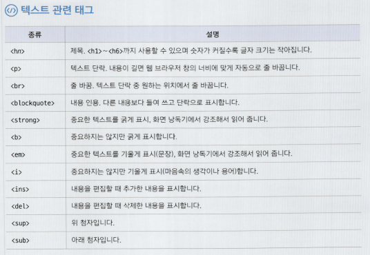
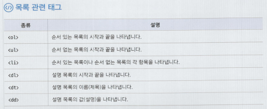
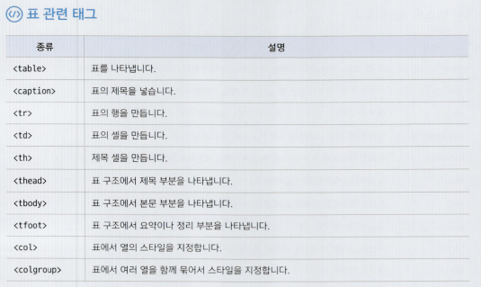
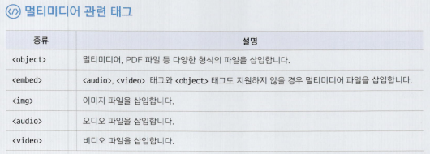

---

```html
ul#menu>li.item*3

.container>(header>nav>li*5>a)+(#content>section)*footer
```

1. 반응형 VS 적응형 (Adaptive)
- 반응형 :
- 적응형 : 각각의 디바이스에 맞는 페이
- 패딩에서 style 주는 것 x
- Style에서 바꾸기
1. favicon 
    
    https://favicon.io/
    
    ```html
    <head>
      <meta charset="UTF-8">
      <title>HTML 기본 문서</title>
      **<link rel="icon" type="image/png" sizes="32x32" href="/favicon.png">**
    </head>
    ```
    
2. 주석 
    
    ```html
    <!-- -->
    ```
    

### 3-4. 시맨틱 태그

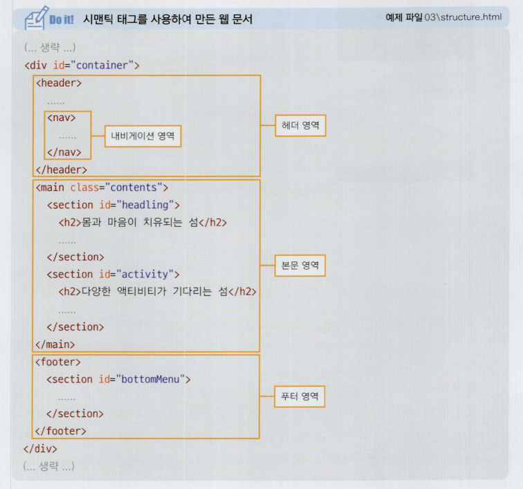
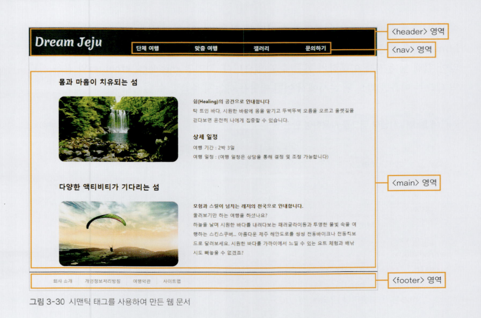

# 4장. 웹 문서에 다양한 내용 입력하기

## 4-1. 텍스트 입력하기

| 종류 | 설명 |
| --- | --- |
| `<hn>제목</hn>` | 제목을 나타내는 ( h1 ~ h6 ) |
| `<p>내용</p>` | 텍스트 단락을 만드는 (문단) |
| `<br>` | 줄을 바꾸는  |
| `<blockquote>인용문</blockquote>` | 인용할 때 쓰는  |
| `<strong>굵게 강조할 텍스트</strong>` <br> `<b> 굵게 표시할 텍스트</b>` | 텍스트 굵게 표시  |
| `<em> </em>` <br> `<i> </i>`  | 이탤릭체  |

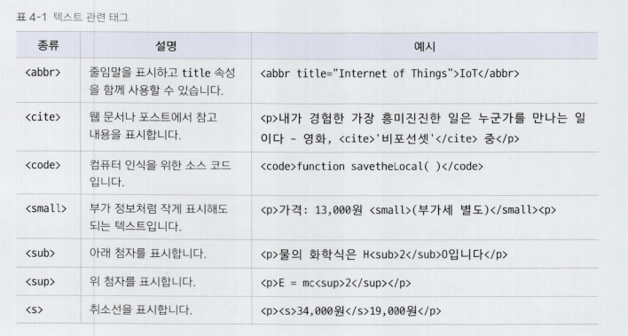
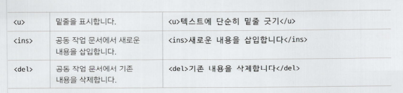

## 4-2. 목록 만들기

1. 순서 있는 목록을 만드는 `<ol> , <li>` 태그
    
    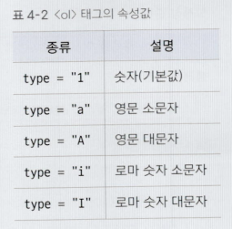
    ```html
    <ol> 
    		<li> 목록1 </li>
    		<li> 목록2 </li>
    </ol>
    ```
    
2. 순서 없는 목록을 만드는 `<ul>, <li> 태그`
    
    ```html
    <ul> 
    		<li> 항목1 </li>
    		<li> 항목2 </li>
    </ul>
    ```
    
3. 설명 목록을 만드는 `<dl>, <dt>, <dd> 태그`
    
    ```html
    <dl> 
    		<dt> 이름 </dt>
    		<dd> 값 </dd>
    </dl>
    
    ---------------------------------
    선물용 3kg
    		소과 13~16과
    		중과 10~12과
    ```
    

## 4-3. 표 만들기

- `<table>` : 표 만들기
- `<caption>` :  표에 제목 붙이기
    - caption → style 주는 것이 좋음
        
        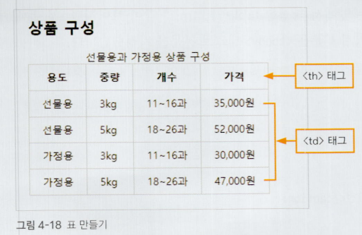
        
    
    ```html
    <table>
        <caption>선물용과 가정용 상품 구성</caption>
        <tr>
          **<th>1행 1열</th>**  
          <td>1행 2열</td>
          <td>1행 2열</td>
    		</tr>
    		<tr>
          **<th>2행 1열</th>**
          <td>2행 2열</td>
          <td>1행 2열</td>
        </tr>
    </table>
    ```
    
- 표의 구조를 지정하는 `<thread>, <tbody>, <tfoot>` 태그
    
    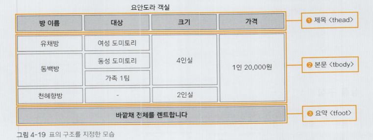
    
- 행이나 열을 합치는 rowspan, colspan 속성
    - 기본형
        - `<td rowspan=”합칠 셀의 개수”>셀의 내용</td>`
        - `<td colspan=”합칠 셀의 개수”>셀의 내용</td>`
- 열을 묶어주는 <col>, <colgroup> 태그
    - 특정 열에 스타일 속성 적용하기
    
    ```html
    <table>
    		<caption> 선물용과 가정용 </caption>
    		<colgroup> 
    				<col> 
    				<col>  <!-- 스타일이 없어도 <col<을 명시 -->
    				<col style="width:150px">
    				<col style="width:150px">
    		</colgroup>
    				
    ```
    

## 4-4. 이미지 삽입하기

1. 이미지를 삽입하는  태그
    - 기본형 : ``
    - 이미지 크기를 조절하는 `width(너비)`, `height(높이)` 속성
        - % : 웹 브라우저 창의 너비와 높이를 기준
        - px : 픽셀

## 4-5. 오디오와 비디오 삽입하기

1. PDF 파일 삽입하기 

```html
<object width="900" height="800" data="product.pdf"></object>
```

1. <embed>태그를 사용해 오디오 파일 삽입하기 
    
    ```html
    <embed src="medias/spring.mp3">
    ```
    
2. 오디오 파일 삽입하기 
    
    ```html
    <audio src="medias/spring.mp3" controls></audio>
    ```
    
3. 비디오 파일 삽입하기 
    
    ```html
    <video src="medias/salad.mp4" controls width="700"></video>
    ```
    
4. 비디오 파일 자동 재생하기 
    
    ```html
    <video src="medias/salad.mp4" width="700" autoplay muted loop></video>
    ```
    
5. `<audio>, <video>` 태그의 속성 
    
    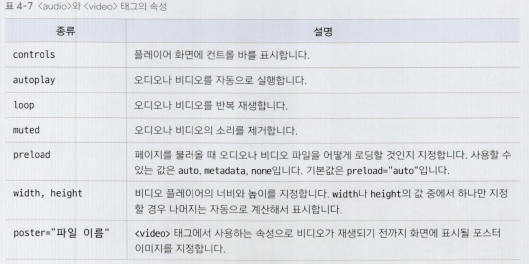
    

## 4-6. 하이퍼링크 삽입하기

1. 텍스트 링크 만들기 
    
    ```html
    <p><a href="../05/order.html">주문서 작성하기</a></p>
    ```
    
2. 이미지 링크 만들기 
    
    ```html
    <a href="../05/order.html"></a>
    ```
    
3. 새 탭에서 문서를 열어주는 `target 속성` 
    
    ```html
    <p><a href="../05/order.html" **target="_blank"**>주문서 작성하기</a></p>
    ```
    

# 5장. 입력 양식 작성하기

## 5-1. 폼 삽입하기

1. 폼을 만드는 <form> 태그
    - 기본형 : `<form [속성=”속성값”]>여러 폼 요소</form>`
    - <form> 태그의 속성
        
        
        | 종류 | 설명 |
        | --- | --- |
        | method | 사용자가 입력한 내용을 서버 쪽 프로그램으로 어떻게 넘겨줄 것인지 지정 <br> 1. get :  입력 내용 제한 o, 사용자가 입력한 내용 그대로 드러남 <br> 2. post : 입력 내용 제한 x  |
        | name | js로 폼 제어할 때 사용할 폼의 이름 지정 |
        | action | <form> 태그 안의 내용을 처리해 줄 서버 프로그램을 지정 |
        | target  | action 속성에서 지정한 스크립트 파일을 현재 창이 아닌 다른 위치에서 열도록 함 |
        - 입력한 폼을 서버로 내보내기
            
            ```html
            <form action="register.php>
            </form>
            ```
            
- 자동 완성 기능을 나타내는 autocomplete 속성
    
    ```html
    	<form action="" autocomplete="off"> /*자동 완성 기능 끄기*/
    </form>
    ```
    
1. 폼 요소를 그룹으로 묶어서 표현하기 
    - `<fieldset [속성=”속성값”]> </fieldset>`
        
        ```html
        <form action="">
            **<fieldset>
              <legend>상품 선택</legend> <!-- <fieldset> 태그로 묶은 그룹에 제목 붙이기 -->
            </fieldset>**
            <fieldset>
              <legend>배송 정보</legend>
            </fieldset>  
        </form>
        ```
        
2. 폼 요소에 레이블을 붙이는 <label> 태그
    - 레이블(lable) : 입력란 가까이에 아이디나 비밀번호처럼 붙여놓은 텍스트
    - 기본형 : `<label for=”id명”> 레이블명<input id=”id명”> </label>`
        
        ```html
        <label **for="user-id"**>아이디(6자 이상)</label>
        <input type="text" **id="user-id"**>
        ```
        

## 5-2. 사용자 입력을 위한 input 태그

1. `<input>` 태그의 type 속성 한눈에 보기 
    
    
    |  type | 설명 | 속성 |
    | --- | --- | --- |
    | text | 텍스트 박스 | size, value, maxlength  |
    | password | 비번 | size, value, maxlength |
    | search | 검색 | required  |
    | url | 주소 | required  |
    | email | 이메일 | required  |
    | tel | 전화번호 | required  |
    | checkbox | 2개 이상 선택 가능한 체크 박스 | value, checked |
    | radio | 1개만 선택 가능 | value, checked |
    | number | 숫자 조절할 수 있는 스핀 박스 | min, max, step, value |
    | range | 숫자 조절할 수 있는 슬라이드 막대 | min, max, step, value |
    | date | 사용자 기준 날짜(연 월, 일) |  |
    | month | 날짜(연, 월) |  |
    | week | 날짜(연, 주) |  |
    | time | 시간(시,분,초,분할 초) |  |
    | datetime | 국제 표준시 - 시간(연, 월, 일, 시, 분, 초, 분할 초) |  |
    | datetime-local | 사용자 지역 - 시간(연, 월, 일, 시, 분, 초, 분할 초) |  |
    | submit | 전송 버튼 | value |
    | reset | 리셋 버튼 | value |
    | image | submit 버튼 대신 사용할 이미지  | src, alt |
    | button | 일반 버튼 | value |
    | file | 파일 첨부 버튼 |  |
    | hidden | 사용자에게 보이지는 않지만 서버로 값 넘겨주는  | value |
2. 텍스트와 비밀번호를 나타내는 `type=”text”`와 `type=”password”`
    - 텍스트, 비밀번호 필드에서 사용하는 주요 속성
        - size : 필드 길이 지정 (사용 거의 x)
        - value : 텍스트 필드 부분에 보여주는 내용
        - maxlength : 최대 문자 수
            
            ```html
            <fieldset>
                	<label>아이디: <input **type="text"** id="user_id" size="10"></label>
                  <label>비밀번호: <input **type="password"** id="user_pw" size="10"></label>
                  <input **type="submit"** value="로그인">
            </fieldset>
            ```
            
3. 다양한 용도에 맞게 입력하는 t`ype=”search”, type=”url”, type=”email”, type=”tel”` 
    - 속성
        - `required` : 반드시 입력해야 함
    
    ```html
    <fieldset>
          <legend>배송 정보</legend>
          <ul id="shipping">
            <li>
              <label for="user-name">이름 </label>
              <input type="text" id="user-name" required>
            </li>
            <li>
              <label for="addr">배송 주소</label>
              <input type="text" id="addr" required>
            </li>
            <li>
              <label for="mail">이메일</label>
              <input type="email" id="mail" required>
            </li>        
            <li>
              <label for="phone">연락처</label>
              <input type="tel" id="phone" required>
            </li>
          </ul>  
        </fieldset>
    ```
    
4. 체크 박스와 라디오 버튼을 나타내는 `type=”checkbox”, type=”radio”`
    - 속성
        - value  : 서버에게 넘겨줄 값 (영문이나 숫자여야 하며, 필수 속성임)
        - checked : 기본 선택
    
    ```html
    <label><input type="checkbox" value="s_3">선물용 3kg</label>
    <label><input type="checkbox" value="s_5">선물용 5kg</label>
    <label><input type="checkbox" value="f_3">가정용 3kg</label>
    <label><input type="checkbox" value="f_5">가정용 5kg</label>
    
    <label><input type="radio" name="gift" value="yes" >선물 포장</label>
    <label><input type="radio" name="gift" value="no">선물 포장 안 함</label>
    ```
    
5. 숫자 입력 필드를 나타내는 `type=”number”, type=”range”`
    - 속성
        - min
        - max
        - step : 숫자 간격 지정 (기본-1)
        - value : 필드에 표시할 초깃값
6. 날짜 입력을 나타내는 `type=”date”, type=”month”, type=”week”`
7. 전송, 리셋 버튼을 나타내는 type=”submit”, type=”reset”
8. 이미지 버튼을 나타내는 type=”image”
9. 기본 버튼을 나타내는 type=”button”
10. 파일을 첨부할 때 사용하는 type=”file”
    
    ```html
    <input type="file">
    ```
    
11. 하드 필드 만들 때 사용하는 type=”hidden”
    - [http://127.0.0.1:5540/05/hidden.html?url=사이트를+통한+직접+로그인&id=asd&password=asd](http://127.0.0.1:5540/05/hidden.html?url=%EC%82%AC%EC%9D%B4%ED%8A%B8%EB%A5%BC+%ED%86%B5%ED%95%9C+%EC%A7%81%EC%A0%91+%EB%A1%9C%EA%B7%B8%EC%9D%B8&id=asd&password=asd)
    - name 속성이 반드시 필요함
        - id와 다름
    
    ```html
    <form>
        <fieldset>
          <input type="hidden" name="url" id="url" value="사이트를 통한 직접 로그인">
        	<label>아이디: <input type="text" name="id" id="user_id" size="10"></label>
          <label>비밀번호: <input type="password" name="password" id="user_pw" size="10"></label>
          <input type="submit" value="로그인">
        </fieldset>
      </form>
    ```
    

## 5-3. input 태그의 주요 속성

1. 자동으로 입력 커서를 갖다 놓는 `autofocus` 속성 
    
    ```html
    <label for="user-name">이름 </label>
    <input type="text" id="user-name" autofocus required>
    ```
    
2. 힌트를 표시해 주는 `placeholder` 속성
    
    ```html
    <label for="phone">연락처</label>
    <input type="tel" id="phone" placeholder="하이픈 빼고 입력해 주세요.(01012345678)" required>
    ```
    
3. 읽기 전용 필드를 만들어 주는 `readonly`속성
    
    ```html
    <label for="prod">주문 상품</label>
    <input type="text" id="prod" value="상품용 3KG" readonly>
    ```
    
4. 필수 입력 필드를 지정하는 `required` 속성 

## 5-4. 폼에서 사용하는 여러 가지 태그

1. 여러 줄을 입력하는 텍스트 영역 `<textarea>` 태그 
    - 속성
        - cols, rows
    
    ```html
    <textarea id="memo" cols="40" rows="4"></textarea>
    ```
    
2. 드롭다운 목록을 만들어주는 `<select>, <option>` 태그 
    ```html
    - <select> 태그 속성
        - size : 화면에 표시할 항목의 개수
        - multiple : 여러 개 선택 가능
    - <option> 태그 속성
        - value : 서버로 넘겨줄 값 지정
        - selected : 기본 선택
    
    ---------------------------------

    <!-- 드롭 다운 목록 -->
        <label for="prod1">상품 선택</label>
        <select id="prod1">
          <option value="special_3" selected>선물용 3kg</option>
          <option value="special_5">선물용 5kg</option>
          <option value="family_3">가정용 3kg</option>
          <option value="family_5">가정용 5kg</option>
        </select>
    ```
    
3. 데이터 목록 만들어 주는 `<datalist>, <option>` 태그 
    
    ```html
    <!-- 데이터 목록 -->
        <label for="prod2">포장 여부 </label>
        <input type="text" id="prod2" list="pack">
        <datalist id="pack">
          <option value="package">선물 포장</option>
          <option value="no_package">포장 안 함</option>
        </datalist>
    ```
    
4. 버튼을 만들어 주는 `<button> 태그` 